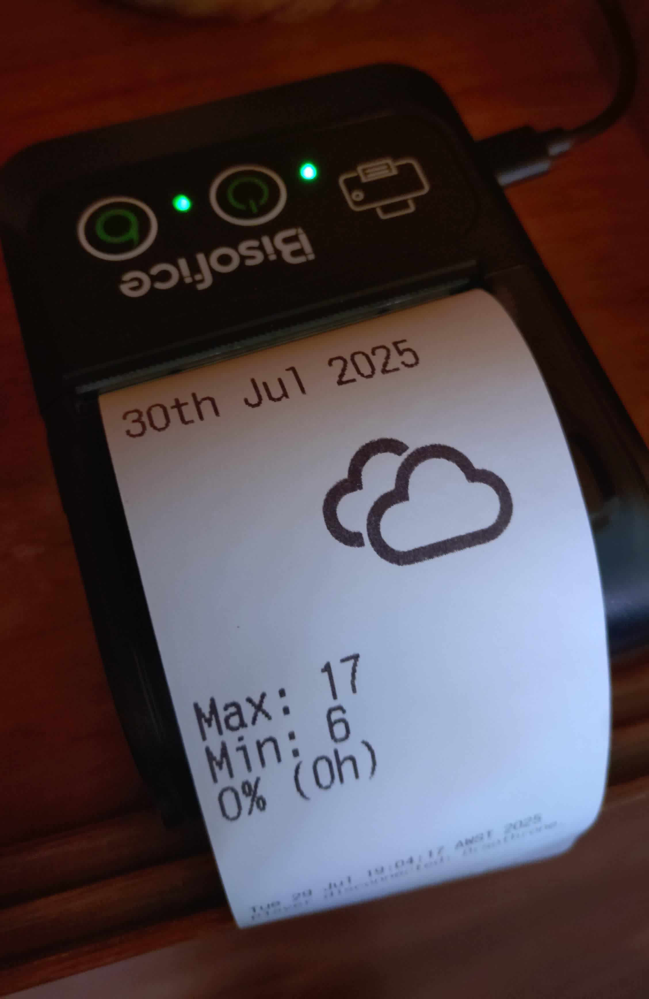

# ESC/POS Weather Printer

Prints a daily weather forecast on an ESC/POS thermal printer, such as the "Bisofice Mini BT thermal receipt printer".



## Dependencies

- **Python 3**
- **Pillow**: The Python imaging library.
- **ImageMagick**: For converting SVG icons to a printable format.

## Setup

1.  **Install dependencies:**

    On Debian/Ubuntu:
    ```bash
    sudo apt-get update && sudo apt-get install imagemagick python3-pil
    ```

    On other systems, install `ImageMagick` via your package manager and `Pillow` via pip:
    ```bash
    pip install Pillow
    ```

2.  **Get the weather icons:**

    Run the script with the `--download-icons` flag to download only the necessary icon files:
    ```bash
    ./printweather.py --download-icons
    ```

    - Or `git clone https://github.com/erikflowers/weather-icons`
    - Or [download the zip](https://github.com/erikflowers/weather-icons/archive/refs/heads/master.zip).

## Usage

Run the script, redirecting the output to your printer device (e.g., `/dev/usb/lp0` or `/dev/ttyUSB0`).

The script can be run from any directory by providing its full path:
```bash
/path/to/print-weather/printweather.py > /dev/usb/lp0
```

### Supplying Coordinates

You can provide GPS coordinates and timezone via command-line arguments or environment variables. If none are provided, the script defaults to London, UK.

The order of command-line arguments is: `LATITUDE LONGITUDE TIMEZONE`

**As command-line arguments:**
```bash
# Example for London
./printweather.py 51.5072 -0.1276 "Europe/London" > /dev/usb/lp0
```

**As environment variables:**
```bash
LATITUDE=51.5072 LONGITUDE=-0.1276 TIMEZONE="Europe/London" ./printweather.py > /dev/usb/lp0
```

## Scheduling with Cron

To run the script automatically at 5am every day in the system's timezone, edit the crontab with `crontab -e` and add the following line.

Because the script can be run from any directory, you no longer need to `cd` into the project folder. You should use the full path to the script.

You can use environment variables to configure the location and timezone.

```
0 5 * * * LATITUDE=51.5072 LONGITUDE=-0.1276 TIMEZONE="Europe/London" /path/to/print-weather/printweather.py > /dev/usb/lp0
```

Note: Replace `/path/to/print-weather/` with the actual path to the project directory.
